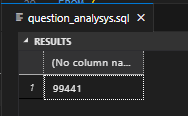
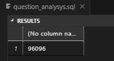
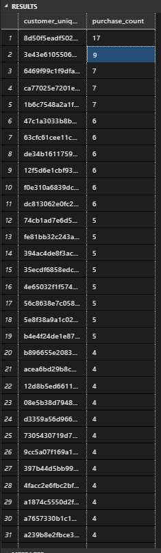
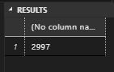
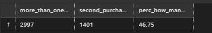

#   Olist SQL Analysys Project

##  About project

This GitHub repository is dedicated to SQL analysys of real marketing e-commerce data - Olist (the biggest Brasilian store with electronics). This repository contains a collection of SQL scripts and queries for various database-related tasks and operations. It serves as a comprehensive resource for SQL developers and enthusiasts to learn, practice, and explore SQL programming. 

The [DB_creation.sql](https://github.com/WarrenGraham/sql_olist_analysys/blob/master/DB_creation.sql) contains set of queries needed to build database architecture such as tables, restrictions of columns, definition of primary and foreign keys. There was provided bulk-insertion of tables with data.

In [question_analysys.sql](https://github.com/WarrenGraham/sql_olist_analysys/blob/master/question_analysys.sql) you will find set of queries which can help dig into data. Each query starts with question from hypothetical stakeholder - execution of query returns the answer ansd let export data from database. Some of queries has been divided into steps with CTE or TEMP. tables. 

##	About dataset
The data in csv. format has been published in kaggle.com - [click here](https://www.kaggle.com/datasets/olistbr/brazilian-ecommerce). This dataset was generously provided by Olist, the largest department store in Brazilian marketplaces. Olist connects small businesses from all over Brazil to channels without hassle and with a single contract. Those merchants are able to sell their products through the Olist Store and ship them directly to the customers using Olist logistics partners. The data granularity is set on order level. 

**Attention**
1. An order might have multiple items.
2. Each item might be fulfilled by a distinct seller.
3. All text identifying stores and partners where replaced by the names of Game of Thrones great houses.

###	Database schema


*Source: [kaggle/olist_brasil](https://www.kaggle.com/datasets/olistbr/brazilian-ecommerce)*

# Execution

## Let's create database

To simulate SQL Server enviroment we have to create database on our local machine. In case of that, execute following batches of [SQL script](https://github.com/WarrenGraham/sql_olist_analysys/blob/master/DB_creation.sql)
```sql
CREATE DATABASE Olist_DB;
USE Olist_DB;
GO
-- customers
DROP TABLE IF EXISTS customers;
GO
CREATE TABLE customers (
	 customer_id varchar(100)
	,customer_unique_id varchar(100)
	,customer_zip_code_prefix varchar(20)
	,customer_city varchar(100)
	,customer_state varchar(20)
	,CONSTRAINT PK_customers PRIMARY KEY ( customer_id )
);
GO
BULK INSERT customers
FROM 'D:\Data Science\projekty\archive (4)\olist_customers_dataset.csv'
WITH ( 
	FIRSTROW = 2,
	ROWTERMINATOR = '0x0a',
	FIELDTERMINATOR = ',',
	FORMAT = 'CSV'
	);
GO
-- geolocation
DROP TABLE IF EXISTS geolocation;
GO
CREATE TABLE geolocation (
	 geolocation_zip_code_prefix varchar(20)
	,geolocation_lat float(50)
	,geolocation_lng float(50)
	,geolocation_city varchar(100)
	,geolocation_state varchar(20)
);
GO
BULK INSERT geolocation
FROM 'D:\Data Science\projekty\archive (4)\olist_geolocation_dataset.csv'
WITH ( 
	FIRSTROW = 2,
	ROWTERMINATOR = '0x0a',
	FIELDTERMINATOR = ',',
	FORMAT = 'CSV'
	);
GO
-- order_items
DROP TABLE IF EXISTS order_items;
GO
CREATE TABLE order_items (
	 order_id varchar(100)
	,order_item_id int
	,product_id varchar(100)
	,seller_id varchar(100)
	,shipping_limit_date datetime2
	,price money
	,freight_value money
	,CONSTRAINT PK_order_items PRIMARY KEY (order_id,order_item_id)
	,CONSTRAINT FK_orders FOREIGN KEY (order_id) REFERENCES orders(order_id)
	,CONSTRAINT FK_order_items FOREIGN KEY (product_id) REFERENCES products(product_id)
	,CONSTRAINT FK_order_sellers FOREIGN KEY (seller_id) REFERENCES sellers(seller_id)	
	);
GO
BULK INSERT order_items
FROM 'D:\Data Science\projekty\archive (4)\olist_order_items_dataset.csv'
WITH ( 
	FIRSTROW = 2,
	ROWTERMINATOR = '0x0a',
	FIELDTERMINATOR = ',',
	FORMAT = 'CSV'
	);
GO
-- order_payments
DROP TABLE IF EXISTS order_payments;
GO
CREATE TABLE order_payments (
	 order_id varchar(100)
	,payment_sequential int
	,payment_type varchar(100)
	,payment_installments int
	,payment_value money
	,CONSTRAINT PK_order_payments PRIMARY KEY (order_id, payment_sequential) 
	,CONSTRAINT FK_payments FOREIGN KEY (order_id) REFERENCES orders(order_id)
	);
GO
BULK INSERT order_payments
FROM 'D:\Data Science\projekty\archive (4)\olist_order_payments_dataset.csv'
WITH ( 
	FIRSTROW = 2,
	ROWTERMINATOR = '0x0a',
	FIELDTERMINATOR = ',',
	FORMAT = 'CSV'
	);
GO
-- order_reviews
DROP TABLE IF EXISTS order_reviews;
GO
CREATE TABLE order_reviews (
	 review_id varchar(100)
	,order_id varchar(100)
	,review_score int
	,review_comment_title varchar(2500)
	,review_comment_message varchar(2500)
	,review_creation_date datetime2
	,review_answer_timestamp datetime2
	,CONSTRAINT PK_order_reviews PRIMARY KEY(review_id, order_id) 
	,CONSTRAINT FK_orders_reviews FOREIGN KEY(order_id) REFERENCES orders(order_id)
	);
GO
BULK INSERT order_reviews
FROM 'D:\Data Science\projekty\archive (4)\olist_order_reviews_dataset.csv'
WITH ( 
	FIRSTROW = 2,
	ROWTERMINATOR = '\n',
	FIELDTERMINATOR = ',',
	FORMAT = 'CSV',
	FIELDQUOTE = '"'
	);
GO
-- orders
DROP TABLE IF EXISTS orders;
GO
CREATE TABLE orders (
	 order_id varchar(100)
	,customer_id varchar(100)
	,order_status varchar(100)
	,order_purchase_timestamp datetime2
	,order_approved_at datetime2
	,order_delivered_carrier_date datetime2
	,order_delivered_customer_date datetime2
	,order_estimated_delivery_date datetime2
	,CONSTRAINT PK_orders PRIMARY KEY(order_id) 
	,CONSTRAINT FK_customers FOREIGN KEY(customer_id) REFERENCES customers(customer_id)
	);
GO
BULK INSERT orders
FROM 'D:\Data Science\projekty\archive (4)\olist_orders_dataset.csv'
WITH ( 
	FIRSTROW = 2,
	ROWTERMINATOR = '0x0a',
	FIELDTERMINATOR = ',',
	FORMAT = 'CSV'
	);
GO
-- products
DROP TABLE IF EXISTS products;
GO
CREATE TABLE products (
	 product_id varchar(100)
	,product_category_name varchar(100)
	,product_name_lenght int
	,product_description_lenght int
	,product_photos_qty int
	,product_weight_g float(20)
	,product_length_cm float(20)
	,product_height_cm float(20)
	,product_width_cm float(20)
	,CONSTRAINT PK_products PRIMARY KEY(product_id) 
	,CONSTRAINT FK_category_name_translation FOREIGN KEY(product_category_name) REFERENCES product_category_name_translation(product_category_name)
	);
GO
BULK INSERT products
FROM 'D:\Data Science\projekty\archive (4)\olist_products_dataset.csv'
WITH ( 
	FIRSTROW = 2,
	ROWTERMINATOR = '0x0a',
	FIELDTERMINATOR = ',',
	FORMAT = 'CSV'
	);
GO
-- sellers
DROP TABLE IF EXISTS sellers;
GO
CREATE TABLE sellers (
	 seller_id varchar(100)
	,seller_zip_code_prefix varchar(20)
	,seller_city varchar(100)
	,seller_state varchar(20)
	,CONSTRAINT PK_sellers PRIMARY KEY(seller_id)
	);
GO
BULK INSERT sellers
FROM 'D:\Data Science\projekty\archive (4)\olist_sellers_dataset.csv'
WITH ( 
	FIRSTROW = 2,
	ROWTERMINATOR = '0x0a',
	FIELDTERMINATOR = ',',
	FORMAT = 'CSV'
	);
GO
-- product_category_name_translation
DROP TABLE IF EXISTS product_category_name_translation;
GO
CREATE TABLE product_category_name_translation (
	 product_category_name varchar(100)
	,product_category_name_english varchar(100)
	,CONSTRAINT PK_product_category_name_translation PRIMARY KEY(product_category_name)
	);
GO
BULK INSERT product_category_name_translation
FROM 'D:\Data Science\projekty\archive (4)\product_category_name_translation.csv'
WITH ( 
	FIRSTROW = 2,
	ROWTERMINATOR = '0x0a',
	FIELDTERMINATOR = ',',
	FORMAT = 'CSV'
	);
```

**Attention**

1. In `BULK INSERT FROM` section has been provided hard coded path to csv. on developer's computer. 
<font color = red size = 5>**You must insert**</font> inside apostrophe marks path to csv on your device. In further work, developer should rewrite script to load data from parameter probided by user of script.

2. If you are running above script in newer version of *SSMS* or other client, like *SQL Server tool for Visual Studio Code*, you may occur an error in BULK insert for some tables. When it happens, run the script batch by batch (code between `GO` key words)

3. In future works developer need to add primary key on `geolocation` and reference it on foreign key in related tables restriction.

##	Exploration on database

In this section you can find question, batch of code witch has been executed, printscreen with part of result. All quoted code you can find in repository in [question_analysys.sql](https://github.com/WarrenGraham/sql_olist_analysys/blob/master/question_analysys.sql)

### Question 1  

> Firstly, let's have a quick look into order database. How many orders we have?

```sql
SELECT 
	COUNT(*) 
FROM 
	orders
```

#### The output



### Question 2 

> On the other hand, how many individual clients had interest in our products?

```sql
SELECT 
	COUNT(DISTINCT customer_unique_id) 
FROM
	customers
```

#### The output



As we can see, in our database there are some clients who had made more than one order. They are our valuable clients, we will talk about them later. 

### Question 3 

> Our stakeholder what to have a list of *loyal clients* with count of orders made by them

```sql
SELECT 
	COUNT(DISTINCT customer_unique_id) 
FROM
	customers
```

#### The output



The developer addictionaly add column with individuals orders per customer.

### Question 4

> Our stakeholder what to have a list of *loyal clients* - who made more than one order - for further advertisment usage.

```sql
SELECT COUNT(*)
FROM (
	SELECT
		 customer_unique_id
		,COUNT(*) AS purchase_count
	FROM customers
	GROUP BY customer_unique_id
	HAVING COUNT(*) > 1) AS loyal_client
```

#### The output



### Question 5

> Finally, our stakeholder gives us some serious task. Having list of *loyal clients* he ask us to calculate percentage of customers, who made second order larger than first one.

We will be using a *CTE - common table expression* and *temporary tables*. Due to temp. tables to avoid errors, we need to drop temp table if exist table named the same. Then, in STEP 5.1 developer create CTE containing information about orders, customers and payment data related to orders. **There are duplicats in order_id**, because one order may be payed in multiple installments and multiple methods of payments like debt + card. Due to it, developer had aggregate data of payments to lower granularity to order payment level. Data is stored in CTE in STEP 5.2 with related `customer_unique_id` and `order_id`. Then in STEP 3.1 we add information about chronological order of orders splitted by every unique customer, and extract value of first and second order. Then, has been extracted list of values 1st and 2nd order of every customer. Nextly, transformed data has been inserted in previously mantioned temporary table to execute 2 queries separately. STEP 5.6 count how many clients made more than 1 order, STEP 5.7 answers how many clients made 2nd order larger than 1st one. In `SELECT` clause has been added `literal` `1` to imitate ID to join STEP 5.7 and STEP 5.8 to perform calculations. Then, count percentage for stakeholder and present result. 

```sql
DROP TABLE IF EXISTS #customers_first_and_second_order_values_TEMP
GO
-- STEP 5.1 -- create table with clients whom made more than one order
WITH orders_CTE (order_id, customer_unique_id, payment_value, order_purchase_timestamp)
AS (
	SELECT
		 OP.order_id
		,C.customer_unique_id
		,OP.payment_value
		,O.order_purchase_timestamp
	FROM order_payments AS OP
	INNER JOIN 
		orders AS O
		ON OP.order_id = O.order_id
	INNER JOIN 
		customers AS C
		ON c.customer_id = O.customer_id
	WHERE
		C.customer_unique_id IN (
			SELECT
				customer_unique_id
			FROM customers
			GROUP BY customer_unique_id
			HAVING COUNT(*) > 1
		)
),
-- STEP 5.2 -- grouped orders_CTE lowers granularity of orders_CTE to sum of each order
grouped_orders_CTE (order_id, customer_unique_id, order_purchase_timestamp, sum_payment_value)
AS (
	SELECT 
		order_id
		,customer_unique_id
		,order_purchase_timestamp
		,SUM(payment_value)
	FROM orders_CTE
	GROUP BY 
		order_id
		,customer_unique_id
		,order_purchase_timestamp
),
-- STEP 5.3 -- add partition by column witch contaitns value of first order and count orders by customer_unique_id
counted_grouped_orders_CTE (customer_unique_id, order_purchase_timestamp, sum_payment_value, customer_first_purchase_amount, customer_second_purchase_amount,order_rank)
AS (
	SELECT 
		customer_unique_id
		,order_purchase_timestamp
		,sum_payment_value
		,FIRST_VALUE(sum_payment_value) OVER (PARTITION BY customer_unique_id ORDER BY order_purchase_timestamp ASC) AS customer_first_purchase_value
		,LEAD(sum_payment_value) OVER (PARTITION BY customer_unique_id ORDER BY order_purchase_timestamp ASC) AS customer_second_purchase_value
		,ROW_NUMBER() OVER(PARTITION BY customer_unique_id ORDER BY order_purchase_timestamp ASC)
	FROM grouped_orders_CTE
),
-- STEP 5.4 -- create list of 1st and 2nd order value for each customer
customers_first_and_second_order_values_CTE (customer_unique_id, customer_first_purchase_amount, customer_second_purchase_amount)
AS (
	SELECT
		customer_unique_id
		,customer_first_purchase_amount
		,customer_second_purchase_amount
	FROM counted_grouped_orders_CTE
	WHERE order_rank = 1
)
-- STEP 5.5 -- save STEP 5.4 result
SELECT *
INTO #customers_first_and_second_order_values_TEMP
FROM customers_first_and_second_order_values_CTE
GO
-- STEP 5.6 -- how many clients made more than 1 order
WITH more_than_one_order_CTE (id, count_result)
AS (
	SELECT 1, COUNT(*) 
	FROM #customers_first_and_second_order_values_TEMP
),
-- STEP 5.7 -- how many clients made 2nd order larger than 1st one
second_more_expensive_CTE (id, count_result)
AS (
	SELECT 1, COUNT(*) 
	FROM #customers_first_and_second_order_values_TEMP
	WHERE customer_second_purchase_amount > customer_first_purchase_amount
)
-- STEP 5.8 -- result table 
SELECT 
	m.count_result AS more_than_one_purchase_client_count
	,s.count_result AS second_purchase_larger_client_count
	,ROUND(CAST(S.count_result AS FLOAT) / CAST(M.count_result AS FLOAT) * 100, 2) AS perc_how_many_clients_2nd_purchase_larger
FROM more_than_one_order_CTE AS M
INNER JOIN second_more_expensive_CTE AS S
	ON M.id = S.id;
```

#### The output



As we can see above, 46% of *loyal customers* made second order greater, in financial way - **that's huge**.


