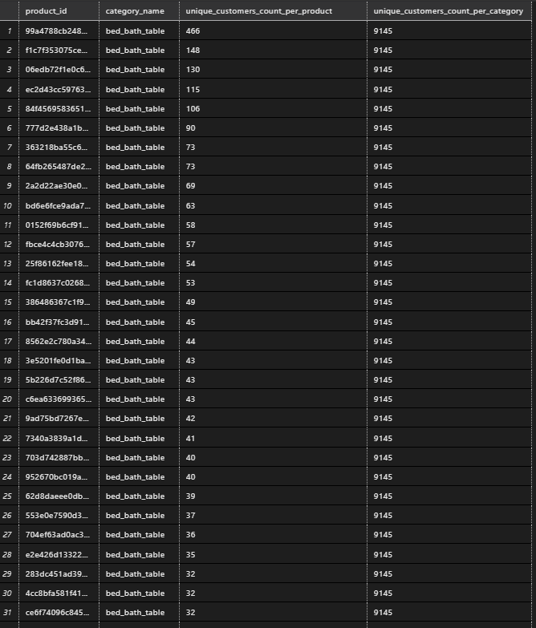

#   Olist SQL Analysys Project

##  About project

This GitHub repository is dedicated to SQL analysys of real marketing e-commerce data - Olist (the biggest Brasilian store with electronics). This repository contains a collection of SQL scripts and queries for various database-related tasks and operations. It serves as a comprehensive resource for SQL developers and enthusiasts to learn, practice, and explore SQL programming. 

The [DB_creation.sql](https://github.com/WarrenGraham/sql_olist_analysys/blob/master/DB_creation.sql) contains set of queries needed to build database architecture such as tables, restrictions of columns, definition of primary and foreign keys. There was provided bulk-insertion of tables with data.

In [question_analysys.sql](https://github.com/WarrenGraham/sql_olist_analysys/blob/master/question_analysys.sql) you will find set of queries which can help dig into data. Each query starts with question from hypothetical stakeholder - execution of query returns the answer ansd let export data from database. Some of queries has been divided into steps with CTE or TEMP. tables. 

##	About dataset
The data in csv. format has been published in kaggle.com - [click here](https://www.kaggle.com/datasets/olistbr/brazilian-ecommerce). This dataset was generously provided by Olist, the largest department store in Brazilian marketplaces. Olist connects small businesses from all over Brazil to channels without hassle and with a single contract. Those merchants are able to sell their products through the Olist Store and ship them directly to the customers using Olist logistics partners. The data granularity is set on order level. 

**Attention**
1. An order might have multiple items.
2. Each item might be fulfilled by a distinct seller.
3. All text identifying stores and partners where replaced by the names of Game of Thrones great houses.

###	Database schema


*Source: [kaggle/olist_brasil](https://www.kaggle.com/datasets/olistbr/brazilian-ecommerce)*

# Execution

## Let's create database

To simulate SQL Server enviroment we have to create database on our local machine. In case of that, execute following batches of [SQL script](https://github.com/WarrenGraham/sql_olist_analysys/blob/master/DB_creation.sql)
```sql
CREATE DATABASE Olist_DB;
USE Olist_DB;
GO
-- customers
DROP TABLE IF EXISTS customers;
GO
CREATE TABLE customers (
	 customer_id varchar(100)
	,customer_unique_id varchar(100)
	,customer_zip_code_prefix varchar(20)
	,customer_city varchar(100)
	,customer_state varchar(20)
	,CONSTRAINT PK_customers PRIMARY KEY ( customer_id )
);
GO
BULK INSERT customers
FROM 'D:\Data Science\projekty\archive (4)\olist_customers_dataset.csv'
WITH ( 
	FIRSTROW = 2,
	ROWTERMINATOR = '0x0a',
	FIELDTERMINATOR = ',',
	FORMAT = 'CSV'
	);
GO
-- geolocation
DROP TABLE IF EXISTS geolocation;
GO
CREATE TABLE geolocation (
	 geolocation_zip_code_prefix varchar(20)
	,geolocation_lat float(50)
	,geolocation_lng float(50)
	,geolocation_city varchar(100)
	,geolocation_state varchar(20)
);
GO
BULK INSERT geolocation
FROM 'D:\Data Science\projekty\archive (4)\olist_geolocation_dataset.csv'
WITH ( 
	FIRSTROW = 2,
	ROWTERMINATOR = '0x0a',
	FIELDTERMINATOR = ',',
	FORMAT = 'CSV'
	);
GO
-- order_items
DROP TABLE IF EXISTS order_items;
GO
CREATE TABLE order_items (
	 order_id varchar(100)
	,order_item_id int
	,product_id varchar(100)
	,seller_id varchar(100)
	,shipping_limit_date datetime2
	,price money
	,freight_value money
	,CONSTRAINT PK_order_items PRIMARY KEY (order_id,order_item_id)
	,CONSTRAINT FK_orders FOREIGN KEY (order_id) REFERENCES orders(order_id)
	,CONSTRAINT FK_order_items FOREIGN KEY (product_id) REFERENCES products(product_id)
	,CONSTRAINT FK_order_sellers FOREIGN KEY (seller_id) REFERENCES sellers(seller_id)	
	);
GO
BULK INSERT order_items
FROM 'D:\Data Science\projekty\archive (4)\olist_order_items_dataset.csv'
WITH ( 
	FIRSTROW = 2,
	ROWTERMINATOR = '0x0a',
	FIELDTERMINATOR = ',',
	FORMAT = 'CSV'
	);
GO
-- order_payments
DROP TABLE IF EXISTS order_payments;
GO
CREATE TABLE order_payments (
	 order_id varchar(100)
	,payment_sequential int
	,payment_type varchar(100)
	,payment_installments int
	,payment_value money
	,CONSTRAINT PK_order_payments PRIMARY KEY (order_id, payment_sequential) 
	,CONSTRAINT FK_payments FOREIGN KEY (order_id) REFERENCES orders(order_id)
	);
GO
BULK INSERT order_payments
FROM 'D:\Data Science\projekty\archive (4)\olist_order_payments_dataset.csv'
WITH ( 
	FIRSTROW = 2,
	ROWTERMINATOR = '0x0a',
	FIELDTERMINATOR = ',',
	FORMAT = 'CSV'
	);
GO
-- order_reviews
DROP TABLE IF EXISTS order_reviews;
GO
CREATE TABLE order_reviews (
	 review_id varchar(100)
	,order_id varchar(100)
	,review_score int
	,review_comment_title varchar(2500)
	,review_comment_message varchar(2500)
	,review_creation_date datetime2
	,review_answer_timestamp datetime2
	,CONSTRAINT PK_order_reviews PRIMARY KEY(review_id, order_id) 
	,CONSTRAINT FK_orders_reviews FOREIGN KEY(order_id) REFERENCES orders(order_id)
	);
GO
BULK INSERT order_reviews
FROM 'D:\Data Science\projekty\archive (4)\olist_order_reviews_dataset.csv'
WITH ( 
	FIRSTROW = 2,
	ROWTERMINATOR = '\n',
	FIELDTERMINATOR = ',',
	FORMAT = 'CSV',
	FIELDQUOTE = '"'
	);
GO
-- orders
DROP TABLE IF EXISTS orders;
GO
CREATE TABLE orders (
	 order_id varchar(100)
	,customer_id varchar(100)
	,order_status varchar(100)
	,order_purchase_timestamp datetime2
	,order_approved_at datetime2
	,order_delivered_carrier_date datetime2
	,order_delivered_customer_date datetime2
	,order_estimated_delivery_date datetime2
	,CONSTRAINT PK_orders PRIMARY KEY(order_id) 
	,CONSTRAINT FK_customers FOREIGN KEY(customer_id) REFERENCES customers(customer_id)
	);
GO
BULK INSERT orders
FROM 'D:\Data Science\projekty\archive (4)\olist_orders_dataset.csv'
WITH ( 
	FIRSTROW = 2,
	ROWTERMINATOR = '0x0a',
	FIELDTERMINATOR = ',',
	FORMAT = 'CSV'
	);
GO
-- products
DROP TABLE IF EXISTS products;
GO
CREATE TABLE products (
	 product_id varchar(100)
	,product_category_name varchar(100)
	,product_name_lenght int
	,product_description_lenght int
	,product_photos_qty int
	,product_weight_g float(20)
	,product_length_cm float(20)
	,product_height_cm float(20)
	,product_width_cm float(20)
	,CONSTRAINT PK_products PRIMARY KEY(product_id) 
	,CONSTRAINT FK_category_name_translation FOREIGN KEY(product_category_name) REFERENCES product_category_name_translation(product_category_name)
	);
GO
BULK INSERT products
FROM 'D:\Data Science\projekty\archive (4)\olist_products_dataset.csv'
WITH ( 
	FIRSTROW = 2,
	ROWTERMINATOR = '0x0a',
	FIELDTERMINATOR = ',',
	FORMAT = 'CSV'
	);
GO
-- sellers
DROP TABLE IF EXISTS sellers;
GO
CREATE TABLE sellers (
	 seller_id varchar(100)
	,seller_zip_code_prefix varchar(20)
	,seller_city varchar(100)
	,seller_state varchar(20)
	,CONSTRAINT PK_sellers PRIMARY KEY(seller_id)
	);
GO
BULK INSERT sellers
FROM 'D:\Data Science\projekty\archive (4)\olist_sellers_dataset.csv'
WITH ( 
	FIRSTROW = 2,
	ROWTERMINATOR = '0x0a',
	FIELDTERMINATOR = ',',
	FORMAT = 'CSV'
	);
GO
-- product_category_name_translation
DROP TABLE IF EXISTS product_category_name_translation;
GO
CREATE TABLE product_category_name_translation (
	 product_category_name varchar(100)
	,product_category_name_english varchar(100)
	,CONSTRAINT PK_product_category_name_translation PRIMARY KEY(product_category_name)
	);
GO
BULK INSERT product_category_name_translation
FROM 'D:\Data Science\projekty\archive (4)\product_category_name_translation.csv'
WITH ( 
	FIRSTROW = 2,
	ROWTERMINATOR = '0x0a',
	FIELDTERMINATOR = ',',
	FORMAT = 'CSV'
	);
```

**Attention**

1. In `BULK INSERT FROM` section has been provided hard coded path to csv. on developer's computer. 
<font color = red size = 5>**You must insert**</font> inside apostrophe marks path to csv on your device. In further work, developer should rewrite script to load data from parameter probided by user of script.

2. If you are running above script in newer version of *SSMS* or other client, like *SQL Server tool for Visual Studio Code*, you may occur an error in BULK insert for some tables. When it happens, run the script batch by batch (code between `GO` key words)

3. In future works developer need to add primary key on `geolocation` and reference it on foreign key in related tables restriction.

##	Exploration on database

In this section you can find question, batch of code witch has been executed, printscreen with part of result. All quoted code you can find in repository in [question_analysys.sql](https://github.com/WarrenGraham/sql_olist_analysys/blob/master/question_analysys.sql)

### Question 1  

> Firstly, let's have a quick look into order database. How many orders we have?

```sql
SELECT 
	COUNT(*) 
FROM 
	orders
```

#### The output


### Question 2 

> On the other hand, how many individual clients had interest in our products?

```sql
SELECT 
	COUNT(DISTINCT customer_unique_id) 
FROM
	customers
```

#### The output


As we can see, in our database there are some clients who had made more than one order. They are our valuable clients, we will talk about them later. 

### Question 3 

> Our stakeholder what to have a list of *loyal clients* with count of orders made by them

```sql
SELECT 
	COUNT(DISTINCT customer_unique_id) 
FROM
	customers
```

#### The output


The developer addictionaly add column with individuals orders per customer.

### Question 4

> Our stakeholder what to have a list of *loyal clients* - who made more than one order - for further advertisment usage.

```sql
SELECT COUNT(*)
FROM (
	SELECT
		 customer_unique_id
		,COUNT(*) AS purchase_count
	FROM customers
	GROUP BY customer_unique_id
	HAVING COUNT(*) > 1) AS loyal_client
```

#### The output


### Question 5

> Finally, our stakeholder gives us some serious task. Having list of *loyal clients* he ask us to calculate percentage of customers, who made second order larger than first one.

We will be using a *CTE - common table expression* and *temporary tables*. Due to temp. tables to avoid errors, we need to drop temp table if exist table named the same. Then, in STEP 5.1 developer create CTE containing information about orders, customers and payment data related to orders. **There are duplicats in order_id**, because one order may be payed in multiple installments and multiple methods of payments like debt + card. Due to it, developer had aggregate data of payments to lower granularity to order payment level. Data is stored in CTE in STEP 5.2 with related `customer_unique_id` and `order_id`. Then in STEP 3.1 we add information about chronological order of orders splitted by every unique customer, and extract value of first and second order. Then, has been extracted list of values 1st and 2nd order of every customer. Nextly, transformed data has been inserted in previously mantioned temporary table to execute 2 queries separately. STEP 5.6 count how many clients made more than 1 order, STEP 5.7 answers how many clients made 2nd order larger than 1st one. In `SELECT` clause has been added `literal` `1` to imitate ID to join STEP 5.7 and STEP 5.8 to perform calculations. Then, count percentage for stakeholder and present result. 

```sql
DROP TABLE IF EXISTS #customers_first_and_second_order_values_TEMP
GO
-- STEP 5.1 -- create table with clients whom made more than one order
WITH orders_CTE (order_id, customer_unique_id, payment_value, order_purchase_timestamp)
AS (
	SELECT
		 OP.order_id
		,C.customer_unique_id
		,OP.payment_value
		,O.order_purchase_timestamp
	FROM order_payments AS OP
	INNER JOIN 
		orders AS O
		ON OP.order_id = O.order_id
	INNER JOIN 
		customers AS C
		ON c.customer_id = O.customer_id
	WHERE
		C.customer_unique_id IN (
			SELECT
				customer_unique_id
			FROM customers
			GROUP BY customer_unique_id
			HAVING COUNT(*) > 1
		)
),
-- STEP 5.2 -- grouped orders_CTE lowers granularity of orders_CTE to sum of each order
grouped_orders_CTE (order_id, customer_unique_id, order_purchase_timestamp, sum_payment_value)
AS (
	SELECT 
		order_id
		,customer_unique_id
		,order_purchase_timestamp
		,SUM(payment_value)
	FROM orders_CTE
	GROUP BY 
		order_id
		,customer_unique_id
		,order_purchase_timestamp
),
-- STEP 5.3 -- add partition by column witch contaitns value of first order and count orders by customer_unique_id
counted_grouped_orders_CTE (customer_unique_id, order_purchase_timestamp, sum_payment_value, customer_first_purchase_amount, customer_second_purchase_amount,order_rank)
AS (
	SELECT 
		customer_unique_id
		,order_purchase_timestamp
		,sum_payment_value
		,FIRST_VALUE(sum_payment_value) OVER (PARTITION BY customer_unique_id ORDER BY order_purchase_timestamp ASC) AS customer_first_purchase_value
		,LEAD(sum_payment_value) OVER (PARTITION BY customer_unique_id ORDER BY order_purchase_timestamp ASC) AS customer_second_purchase_value
		,ROW_NUMBER() OVER(PARTITION BY customer_unique_id ORDER BY order_purchase_timestamp ASC)
	FROM grouped_orders_CTE
),
-- STEP 5.4 -- create list of 1st and 2nd order value for each customer
customers_first_and_second_order_values_CTE (customer_unique_id, customer_first_purchase_amount, customer_second_purchase_amount)
AS (
	SELECT
		customer_unique_id
		,customer_first_purchase_amount
		,customer_second_purchase_amount
	FROM counted_grouped_orders_CTE
	WHERE order_rank = 1
)
-- STEP 5.5 -- save STEP 5.4 result
SELECT *
INTO #customers_first_and_second_order_values_TEMP
FROM customers_first_and_second_order_values_CTE
GO
-- STEP 5.6 -- how many clients made more than 1 order
WITH more_than_one_order_CTE (id, count_result)
AS (
	SELECT 1, COUNT(*) 
	FROM #customers_first_and_second_order_values_TEMP
),
-- STEP 5.7 -- how many clients made 2nd order larger than 1st one
second_more_expensive_CTE (id, count_result)
AS (
	SELECT 1, COUNT(*) 
	FROM #customers_first_and_second_order_values_TEMP
	WHERE customer_second_purchase_amount > customer_first_purchase_amount
)
-- STEP 5.8 -- result table 
SELECT 
	m.count_result AS more_than_one_purchase_client_count
	,s.count_result AS second_purchase_larger_client_count
	,ROUND(CAST(S.count_result AS FLOAT) / CAST(M.count_result AS FLOAT) * 100, 2) AS perc_how_many_clients_2nd_purchase_larger
FROM more_than_one_order_CTE AS M
INNER JOIN second_more_expensive_CTE AS S
	ON M.id = S.id;
```

#### The output


As we can see above, 46% of *loyal customers* made second order greater, in financial way - **that's huge**.

### Question 6

> Now, stakeholder has interest in sliceing orders value by city. **Whitch city citizens have the thickiest wallet?**

Like in question 5, we will use temporary table. Firstly, we drop table to avoid future errors. Then, we use CTE to group all payments by orders to have orders vs value as an output. In step 6.2 CTE is grouping orders by customer city and performing sums, counts and avarages. The output is exported to temporary table for further usage, the result is beeing displayed in step 6.4.

```sql
-- STEP 6.1 calculate table, summing orders value
DROP TABLE IF EXISTS #group_by_countries_temp
GO
WITH orders_payment_values_CTE(order_id, order_value)
AS (
	SELECT
		order_id
		,SUM(payment_value)
	FROM order_payments
	GROUP BY order_id
),
-- STEP 6.2 calculate table, summing orders value
group_by_cities_CTE(customer_city, number_of_orders, avarage_order_value, total_order_value)
AS(
	SELECT
		C.customer_city
		,COUNT(*) AS number_of_orders
		,ROUND(AVG(OPV.order_value), 2) AS avarage_order_value
		,SUM(OPV.order_value) AS total_order_value
	FROM orders_payment_values_CTE AS OPV
	INNER JOIN orders AS O
		ON OPV.order_id = O.order_id
	INNER JOIN customers AS C
		ON O.customer_id = C.customer_id
	GROUP BY C.customer_city
)
-- STEP 6.3 create temp table (for further usage)
SELECT * 
INTO #group_by_countries_temp
FROM group_by_cities_CTE
GO
-- STEP 6.4 display result
SELECT * 
FROM #group_by_countries_temp;
```

#### The output


### Question 7

> Stakeholder wants to know is *Paretho* rule true for this data distribution. *Paretho rule* says: *"Top twenty percentage of your sellers make eighty percentage of value, and eighty percentage of sellers make the rest of value".* **Is this applied here?**

Must have to execute this query correctly is executing question 6 query first - query uses temporary table mantioned in question beforte. Then, in STEP 7.2 is adding running totals useing window functions and percentage of influence in global value. If running influence is below 80% then insert in condidional columnt 1, else 0. We expect, if Paretho rule is applied here, ones to be 20% of 
all population. At the and, we dividing sum of all ones by number of all rows in `#running_total_temp` in percentage format. 

```sql
-- STEP 7.1
-- execute question 6 query to create #group_by_countries_temp
-- STEP 7.2 -- add running total column and populate paretho check
SELECT
	*
	,SUM(total_order_value) OVER (ORDER BY total_order_value DESC) AS running_total_order_value
	,( SUM(total_order_value) OVER (ORDER BY total_order_value DESC) ) * 100 / ( SUM(total_order_value) OVER() ) AS perc
	,CASE 
		WHEN ( SUM(total_order_value) OVER (ORDER BY total_order_value DESC) ) * 100 / ( SUM(total_order_value) OVER() ) <= 80
		THEN 1 
		ELSE 0 
	END AS paretho_check_city_customer
INTO #running_total_temp
FROM #group_by_countries_temp
-- show only 80% value cities
SELECT *
FROM #running_total_temp
WHERE paretho_check_city_customer = 1;
-- is 20% of cities makeing 80% of order value
SELECT ROUND(CAST(SUM(paretho_check_city_customer) AS float) * 100 / CAST(COUNT(*) AS float), 2)
FROM #running_total_temp
```

#### The output


As we can see above, approximately 9% of cities is makeing 80% of income. This is even sharper data distribution than Paretho rule is saying. **Our stakeholder's business should focus mainly on customers from this 9% of cities.** 

### Question 8

> Stakeholder had appreciated our analysys from question 6. He want to find is there correlation seller city origin vs seller city customer. 

Query below works analogycal to query in question 6, but operates on seller city column. Unfortunately it t appears to one mistake value in seller_city column. We talked with data engineers team and they reccomended to set damaged row's seller_city value to unknown. This admin action has been executed in STEP 8.4.3. We checked in STEP 8.4.4. for nulls. The rest of query has same logic as query 6.
```sql
-- STEP 8.1 calculate table, summing orders value
DROP TABLE IF EXISTS #group_by_seller_city_temp
GO
WITH orders_payment_values_CTE(order_id, order_value)
AS (
	SELECT
		order_id
		,SUM(payment_value)
	FROM order_payments
	GROUP BY order_id
),
-- STEP 8.2 calculate table, summing orders value
group_by_seller_city_CTE(seller_city, number_of_orders, avarage_order_value, total_order_value) 
AS(
	SELECT
		S.seller_city
		,COUNT(*) AS number_of_orders
		,ROUND(AVG(OPV.order_value), 2) AS avarage_order_value
		,SUM(OPV.order_value) AS total_order_value
	FROM orders_payment_values_CTE AS OPV
	INNER JOIN 
		orders AS O
		ON OPV.order_id = O.order_id
	INNER JOIN 
		order_items AS OI
		ON O.order_id = OI.order_id
	INNER JOIN 
		sellers AS S
		ON OI.seller_id = S.seller_id
	GROUP BY S.seller_city
)
-- STEP 8.3 create temp table (for further usage)
SELECT * 
INTO #group_by_seller_city_temp
FROM group_by_seller_city_CTE;
-- 8.4.1 display results
SELECT *
FROM #group_by_seller_city_temp
-- 8.4.2 it appears to one mistake value in seller_city column - first value
SELECT DISTINCT seller_city 
FROM sellers
ORDER BY 1 ASC;
-- 8.4.3 set null in incorect field
UPDATE sellers
SET seller_city = null
WHERE seller_city = '04482255';
-- 8.4.4 check for nulls 
SELECT 
	SUM(CASE 
			WHEN seller_city IS NULL
			THEN 1 
			ELSE 0
		END
	)
FROM sellers;
-- 8.5 is paretho true for running totals? 
-- you need to execute 8.3 first
SELECT
	*
	,SUM(total_order_value) OVER (ORDER BY total_order_value DESC) AS running_total_order_value
	,( SUM(total_order_value) OVER (ORDER BY total_order_value DESC) ) * 100 / ( SUM(total_order_value) OVER() ) AS perc
	,CASE 
		WHEN ( SUM(total_order_value) OVER (ORDER BY total_order_value DESC) ) * 100 / ( SUM(total_order_value) OVER() ) <= 80
		THEN 1
		ELSE 0
	END AS paretho_check_city_seller
INTO #seller_cities_paretho_check_temp
FROM #group_by_seller_city_temp
ORDER BY perc;
-- is 20% of sellers group by headquater city makeing 80% of order value
SELECT ROUND(CAST(SUM(paretho_check_city_seller) AS float) * 100 / CAST(COUNT(*) AS float), 2)
FROM #seller_cities_paretho_check_temp;
```

#### The output


### Question 9

> Having previous analysys, stakeholder ask serious question. We want to know how many of trade is made to local customers (seller city = customer city)

Firstly, CTE gather all payments by orders. Then, we aggregate information such as counts sums and avarages sliceing by seller city and customer city separately. Then, we are joining to CTE's togather to show in one table with calculation of percentage of local customers. **Be carefull**: there are unknown values(nulls) in 

```sql
-- STEP 9.1 calculate table, summing orders value
WITH orders_payment_values_CTE(order_id, order_value)
AS (
	SELECT
		order_id
		,SUM(payment_value)
	FROM order_payments
	GROUP BY order_id
),
-- STEP 9.2 calculate table, summing orders value and hometown check
hometown_purchases_city_CTE(seller_city, customer_city, number_of_orders, avarage_order_value, total_order_value)  
AS(
	SELECT
		S.seller_city
		,C.customer_city
		,COUNT(*) AS number_of_orders
		,ROUND(AVG(OPV.order_value), 2) AS avarage_order_value
		,SUM(OPV.order_value) AS total_order_value
	FROM orders_payment_values_CTE AS OPV
	INNER JOIN 
		orders AS O
		ON OPV.order_id = O.order_id
	INNER JOIN 
		order_items AS OI
		ON O.order_id = OI.order_id
	INNER JOIN 
		sellers AS S
		ON OI.seller_id = S.seller_id
	INNER JOIN
		customers AS C 
		ON C.customer_id = O.customer_id
	WHERE S.seller_city = C.customer_city
	GROUP BY
		S.seller_city
		,C.customer_city
),
all_purchases_city_group_by_CTE(seller_city, number_of_orders, avarage_order_value, total_order_value)  
AS(
	SELECT
		S.seller_city
		,COUNT(*) AS number_of_orders
		,ROUND(AVG(OPV.order_value), 2) AS avarage_order_value
		,SUM(OPV.order_value) AS total_order_value
	FROM orders_payment_values_CTE AS OPV
	INNER JOIN 
		orders AS O
		ON OPV.order_id = O.order_id
	INNER JOIN 
		order_items AS OI
		ON O.order_id = OI.order_id
	INNER JOIN 
		sellers AS S
		ON OI.seller_id = S.seller_id
	GROUP BY
		S.seller_city
)
-- results and percentage of local trades
SELECT 
	 _hometown.seller_city AS city
	,_hometown.number_of_orders AS HOMETOWN_orders_count
	,_all.number_of_orders AS ALL_orders_count
	,_hometown.avarage_order_value AS HOMETOWN_avg_order_value
	,_all.avarage_order_value AS ALL_avg_order_value
	,_hometown.total_order_value AS HOMETOWN_total_order_value
	,_all.total_order_value AS ALL_total_order_value
	,ROUND(CAST(_hometown.number_of_orders as float) * 100 / CAST(_all.number_of_orders as float), 2) AS perc_hometown_orders
	,ROUND(CAST(_hometown.total_order_value as float) * 100 / CAST(_all.total_order_value as float), 2) AS perc_hometown_order_value
FROM all_purchases_city_group_by_CTE AS _all
INNER JOIN hometown_purchases_city_CTE AS _hometown
	ON _hometown.seller_city = _all.seller_city
ORDER BY perc_hometown_order_value DESC
```

#### The output


In TOP 5 cities we can see Chapeco, `Rio de Janerio, Sao Paolo, Mogli das cruzes, Sao Jaso.` Only in Rio de Janerio and Sao Paolo we had significant amount of transactions - this to cities has meaningfull community of local customers. 

### Question 10

> > It's time for opperation efficency - **what is a status of our orders delivery?**

```sql
SELECT 
	 O.order_status
	,SUM(OI.price) AS order_total_value
FROM orders AS O
INNER JOIN order_items AS OI
	ON O.order_id = OI.order_id
GROUP BY O.order_status;
```

#### The output


Orders values(financially) sliced by delivery status. 

### Question 11

> The stakeholder wants us to count how many individal clients purchase each product and each product category.

Here, we are touching the problem of granularity level. We could present data in 2 diffrent tables, but giving answer in one table format is sexier, according to developer judgement. Firstly, CTE in STEP 11.1 join data of ech customer with product category and count orders. We use `LEFT JOIN` because database do not contain translation from brasil to english for all categories. Addicionally, not every product has related product category. We intentionally ommit this data. Then, in 11.2 querry do this same but on individal product granularity level. Nextly, in 11.3 data are beeing connected each other. Addicionally, we check why nulls exist in `products` table -> because not every product has assigned product category.


```sql
-- STEP 11.1 Count on product_category granularity
WITH product_category_CTE(x,y)
AS(
	SELECT 
		translation.product_category_name_english	
		,COUNT(DISTINCT C.customer_unique_id) AS Unique_Customers_Count
	FROM customers AS C
	INNER JOIN orders AS O
		ON C.customer_id = O.customer_id
	INNER JOIN order_items AS OI
		ON OI.order_id = O.order_id
	INNER JOIN products AS P
		ON OI.product_id = P.product_id
	LEFT JOIN product_category_name_translation AS translation
		ON translation.product_category_name = P.product_category_name
	GROUP BY translation.product_category_name_english	
),
-- STEP 11.2 Count on product granularity
product_name_CTE(x,y,z)
AS(
	SELECT 
		 translation.product_category_name_english
		,P.product_id	
		,COUNT(DISTINCT C.customer_unique_id) AS unique_customers_count
	FROM customers AS C
	INNER JOIN orders AS O
		ON C.customer_id = O.customer_id
	INNER JOIN order_items AS OI
		ON OI.order_id = O.order_id
	INNER JOIN products AS P
		ON OI.product_id = P.product_id
	LEFT JOIN product_category_name_translation AS translation
		ON translation.product_category_name = P.product_category_name
	GROUP BY 
		 translation.product_category_name_english
		,P.product_id
)
-- STEP 11.3 Join 2 CTE, present results
SELECT 
	 product.y AS product_id
	,product.x AS category_name
	,product.z AS unique_customers_count_per_product 
	,category.y AS unique_customers_count_per_category
FROM product_category_CTE AS category
INNER JOIN product_name_CTE AS product
	ON category.x = product.x
ORDER BY
	 4 DESC 
	,2 ASC
	,3 DESC 
	,1 ASC 
-- check for nulls - why they here?
SELECT * 
FROM products
WHERE product_category_name IS NULL
```

#### The output




### Question 12

> Another serious task comes from stakeholder. Buisness is trying to reach to `open-minded` customers - they are defined as *clients who made at least 3 purchases and at least one in other product_category*. Stakeholders wants you to give him the list of `open-minded` clients. 

This query is tricky-one. Firstly, in STEP 12.1 we join `customer_unique_id` with information about product category. We use `LEFT JOIN` because database do not contain translation from brasil to english for all categories. Addicionally, not every product has related product category. We intentionally ommit this data. In STEP 12.1 we create list of customers who made purchases in more than one product category. IN STEP 12.2 we create list with clients who made at least 3 orders. The common part of these to list is set of `open-minded` customers. 

```sql
-- STEP 12.1 Count purchases per customer in unique category
WITH category_customer_puchases_CTE(customer_unique_id)
AS(
	SELECT
		c.customer_unique_id
	FROM customers AS C
	INNER JOIN orders AS O
		ON C.customer_id = O.customer_id
	INNER JOIN order_items AS OI
		ON OI.order_id = O.order_id
	INNER JOIN products AS P
		ON OI.product_id = P.product_id
	LEFT JOIN product_category_name_translation AS translation
		ON translation.product_category_name = P.product_category_name
	GROUP BY 
		c.customer_unique_id
	HAVING COUNT(DISTINCT translation.product_category_name_english) >= 2
),
-- STEP 12.2 Count all puchases per customer
all_purchases_count_CTE(customer_unique_id)
AS(
	SELECT
		 c.customer_unique_id
	FROM customers AS C
	INNER JOIN orders AS O
		ON C.customer_id = O.customer_id
	INNER JOIN order_items AS OI
		ON OI.order_id = O.order_id
	INNER JOIN products AS P
		ON OI.product_id = P.product_id
	LEFT JOIN product_category_name_translation AS translation
		ON translation.product_category_name = P.product_category_name
	GROUP BY 
		c.customer_unique_id
	HAVING
		COUNT(*) >= 3
)
-- STEP 12.3 Display results
SELECT
	cat.customer_unique_id	
FROM category_customer_puchases_CTE AS cat
INNER JOIN all_purchases_count_CTE AS _all
	ON cat.customer_unique_id = _all.customer_unique_id
```

#### The output


# Summary

-- -- -- -- -- -- 
-- -- -- -- -- -- 
-- -- -- -- -- -- 
